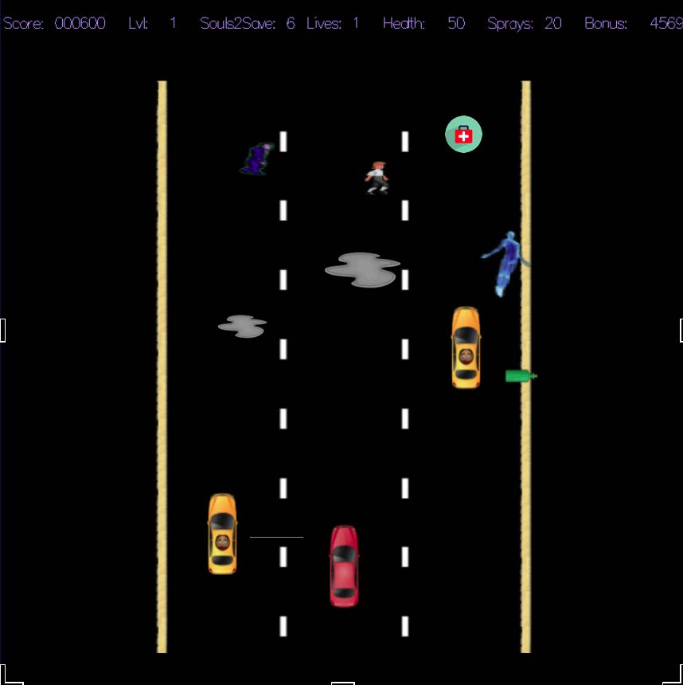

# GhostRacer

A shooting game. UCLA CS32 Project 3.

Tested on macOS, requires [XQuartz](http://xquartz.org/) and freeGLUT to compile and run. Game [skeleton](./GhostRacer-skeleton-cmdmac/) (GUI and keyboard listener) provided by Professor.

More information about the game and project in [spec.pdf](https://github.com/hanryxu/GhostRacer/blob/master/spec.pdf)

Game sample screenshot:

